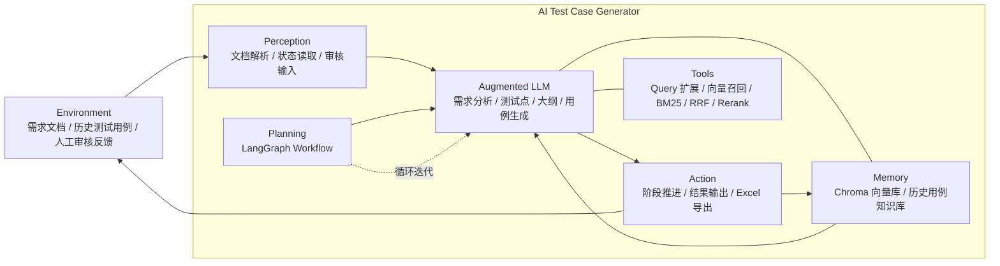

# AI Test Case Generator

一个基于 `Streamlit + LangGraph + LangChain + Chroma + OpenAI-Compatible LLM` 的 AI 测试用例生成工具，
并集成了 [qa-skills](https://github.com/fishzjp/qa-skills) 的八阶段测试流水线方法论。

它的目标是把“需求文档 -> 需求理解 -> 测试策略 -> 测试点 -> 测试大纲 -> 测试用例 -> 审查 -> 执行回收 -> Bug 分析 -> 回归 -> 测试报告”这一整条链路串起来，并且允许你在关键阶段做人审和修改。

简单说：**项目提供工程能力（RAG 检索、工作流编排、交互界面），qa-skills 提供方法论（风险模型、证据分级、用例格式标准、Schema 契约与校验）**。

这份 README 面向零基础同学编写。你不需要先懂 LangGraph、RAG、向量库、Prompt Engineering，也可以按步骤把项目跑起来，并理解代码每一部分在做什么。

---

## 1. 项目能做什么

这个项目当前已经具备以下核心能力：

- 上传需求文档，支持 `Markdown(.md)` 和 `Word(.docx)`
- 自动解析文档结构
- 将需求文档切块并写入本地向量库
- 基于 RAG 检索需求依据
- 支持混合检索：向量召回 + BM25 召回 + RRF 融合
- 生成结构化需求模型（目标/范围/非目标/角色/规则/状态流转/异常/依赖/待澄清）
- 生成测试策略：Risk Map（风险 = Impact × Likelihood，强制挂证据）+ 功能域六轴 + 类型域十轴决策
- 从需求模型与策略中提取测试点（挂 `risk_ref` 追溯到风险）
- 基于测试点生成测试大纲（模块划分决定用例编号）
- 基于测试大纲生成符合 qa-skills 用例格式标准的可执行用例
- 对用例做独立审查（覆盖 + 可执行性双线）
- 生成 API（pytest + requests）与 E2E（Playwright）执行脚本骨架
- 回收执行结果（解析 pytest 输出 / JUnit XML / 手工录入）
- Bug 分析与分级回归清单
- 生成对齐 `core/report-template.md` 的测试报告（含机读摘要）
- 支持上传历史测试用例知识库，辅助生成新用例
- 支持对每个阶段结果进行人工审核和修改
- 导出 Excel 测试用例文件，并同步产出 qa-skills 双轨产物（markmap + schema.yaml）
- 展示每个阶段的检索依据、引用、rerank 状态和降级原因
- 落盘产物可回流向量库，让本轮产出成为下一轮的知识资产

---

## 2. 项目整体流程

从产品视角看，这个项目的执行流程是：

1. 用户上传需求文档，系统解析并切块入库
2. 检索文档片段，LLM 生成**需求模型**（目标/范围/角色/规则/状态流转/待澄清）
3. 用户审核需求模型
4. LLM 生成**测试策略**（Risk Map + 功能域六轴 + 类型域十轴）
5. 用户审核测试策略（重点核对风险评级与证据）
6. LLM 提取**测试点**（挂 `risk_ref` 追溯风险）
7. 用户审核测试点
8. LLM 生成**测试大纲**（模块划分决定用例编号）
9. 用户审核测试大纲
10. 系统检索需求依据和历史用例依据，LLM 生成**测试用例**（含执行模型分类与冒烟序号）
11. 用户审核测试用例
12. LLM 对用例做**独立审查**（覆盖 + 可执行性双线），用户决定是否采纳
13. 系统导出 Excel，并落盘 qa-skills 双轨产物（markmap + schema.yaml + 策略 + 需求模型），校验 Schema 契约
14. **执行回收**：解析 pytest 输出 / JUnit XML / 手工录入，生成执行脚本骨架
15. **Bug 分析**：对失败用例做分级（S0/S1/S2）与根因分析
16. **回归清单**：按 Bug 影响范围与风险等级生成分级回归范围
17. **测试报告**：按 `core/report-template.md` 生成机读报告

从代码视角看，这条链路主要由下面几部分组成：

- Web 界面：`app/app.py`
- 工作流编排：`workflow/workflow.py`（11 个节点、9 处中断）
- 工作流节点：`workflow/nodes.py`
- Prompt + 结构化输出：`skills/*.md` + `skills/test_design_skills.py`
- 文档解析：`utils/document_parser/`
- 向量入库：`rag/ingest.py`、`rag/artifact_ingest.py`
- 文档检索：`rag/retriever.py`
- 重排 rerank：`rag/reranker.py`
- 双轨导出：`utils/exporters/`（markmap_exporter + schema_exporter）
- 执行闭环：`execution/result_parser.py`、`execution/scaffolds.py`
- 落盘管理：`utils/artifacts.py`
- Excel 导出：`utils/excel_exporter/excel_exporter.py`
- 方法论校验：`core/`（qa-skills：schema 校验、报告模板等）

### 2.1 架构图



---

## 3. 适合谁使用

这个项目适合：

- 测试工程师
- 测试开发工程师
- 产品经理
- 希望用 AI 辅助测试设计的开发者
- 想学习 LangGraph + RAG 实战项目的人

---

## 4. 项目目录结构

```text
ai-test-case-generator/
├─ app/
│  └─ app.py                         # Streamlit Web 入口：十一阶段交互、数据编辑、下载、回流
├─ artifacts/                        # 流水线落盘产物（运行时生成，不入库）
│  └─ {项目名}/
│     ├─ 需求模型.md
│     ├─ 测试策略.md
│     ├─ 测试用例_markmap.md         # qa-skills 主产物（大纲 + 用例正文 + 统计 + 目录）
│     ├─ 测试用例.schema.yaml        # qa-skills 机读 Schema（下游脚本 / 工具消费）
│     ├─ 手动执行记录_YYYYMMDD.md
│     └─ 测试报告_YYYYMMDD.md
├─ core/                             # qa-skills（https://github.com/fishzjp/qa-skills）
│  ├─ scripts/validate_schema.py     # markmap ↔ schema.yaml 一致性校验
│  ├─ template/report-template.md    # 测试报告模板（机器可读）
│  └─ ...                            # 其余方法论文件
├─ data/
│  └─ chroma/                        # Chroma 向量库持久化目录
├─ execution/
│  ├─ result_parser.py               # pytest / JUnit XML / 手工执行结果回收
│  ├─ scaffolds.py                   # API（pytest+requests）与 E2E（Playwright）脚本骨架
│  └─ record_formats.py              # 执行记录数据结构与 jUnit 解析
├─ output/                           # 导出的 Excel 文件
├─ rag/
│  ├─ config.py                      # RAG 配置
│  ├─ ingest.py                      # 文档入库
│  ├─ artifact_ingest.py             # 落盘产物回流知识库
│  ├─ query_expander.py              # Query 扩展
│  ├─ reranker.py                    # Rerank 排序
│  ├─ retriever.py                   # 检索逻辑
│  ├─ schemas.py                     # Chunk / Citation 数据结构
│  ├─ store.py                       # 向量库与 Embedding 初始化
│  ├─ index_testcase_kb.py           # 历史测试用例批量入库脚本
│  └─ eval_offline.py                # 离线检索验证脚本
├─ skills/
│  ├─ analyze_requirement_skill.md   # 需求分析 Prompt（qa-skills 需求模型）
│  ├─ test_strategy_skill.md         # 测试策略 Prompt（Risk Map + 两域十轴）
│  ├─ extract_test_points_skill.md   # 测试点提取 Prompt
│  ├─ generate_outline_skill.md      # 测试大纲 Prompt
│  ├─ generate_cases_skill.md        # 测试用例 Prompt（qa-skills 用例格式标准）
│  ├─ review_cases_skill.md          # 用例审查 Prompt（覆盖 + 可执行性双线）
│  ├─ bug_analysis_skill.md          # Bug 分析 Prompt（S0/S1/S2 定级）
│  ├─ regression_skill.md            # 回归清单 Prompt（回归触发规则）
│  ├─ test_report_skill.md           # 测试报告 Prompt（对齐 report-template）
│  └─ test_design_skills.py          # Prompt 调用与结构化输出封装
├─ utils/
│  ├─ artifacts.py                   # 落盘管理：产物目录 / 日期文件名 / 项目名净化
│  ├─ case_ids.py                    # 用例编号规范化（TC-{模块}-{序号}）与冒烟序号
│  ├─ document_parser/
│  │  ├─ parser.py                   # 文档结构基础数据结构
│  │  ├─ md_parser.py                # Markdown 解析
│  │  ├─ docx_parser.py              # DOCX 解析
│  │  └─ run_parser_demo.py          # 文档解析演示脚本
│  ├─ exporters/
│  │  ├─ markmap_exporter.py         # 用例大纲导出为 qa-skills markmap
│  │  └─ schema_exporter.py          # 用例导出为 schema.yaml + Schema 校验封装
│  └─ excel_exporter/
│     └─ excel_exporter.py           # Excel 导出工具
├─ workflow/
│  ├─ state.py                       # LangGraph 状态定义（含执行/回归/报告字段）
│  ├─ schemas.py                     # TestPoint / TestOutline / TestCase 结构
│  ├─ nodes.py                       # 各工作流节点实现（11 个）
│  ├─ workflow.py                    # LangGraph 工作流定义（9 处 interrupt）
│  ├─ checkpoint_store.py            # 会话持久化（SQLite checkpointer）
│  └─ main_test.py                   # 工作流验证脚本
├─ .env                              # 你的本地环境变量
├─ .env.example                      # 环境变量模板
└─ README.md                         # 项目文档
```

---

## 5. 运行前你需要准备什么

### 5.1 Python 环境

建议：

- Python 3.10+
- Windows / macOS / Linux 都可以

### 5.2 模型 API

你至少需要一个 OpenAI 兼容接口：

- OpenAI 官方接口
- 或者 OpenAI-Compatible 接口
- 或者公司内部兼容 OpenAI 的代理服务

项目里用到两个模型能力：

- 聊天模型：生成需求分析、测试点、大纲、测试用例
- Embedding 模型：做向量检索

注意：

- 聊天模型必须可用，否则工作流会卡在 LLM 调用阶段
- Embedding 模型不可用时，项目有本地兜底 `LocalHashEmbeddings`

### 5.3 可选的本地 rerank 模型

当前默认 `rerank` 配置是：

- `RERANK_MODE = "cross_encoder"`
- `RERANK_CROSS_ENCODER_MODEL = "BAAI/bge-reranker-v2-m3"`

这表示系统会优先使用本地 cross-encoder 重排。

如果模型：

- 本地没有缓存
- 无法联网下载
- 加载失败
- 推理超时

系统会自动回退到 `lite` 模式。

---

## 6. 安装与启动

### 6.1 安装依赖

如果你有 `requirements.txt`，通常可以：

```bash
pip install -r requirements.txt
```

如果项目里没有整理好的依赖文件，你至少需要这些核心依赖：

```bash
pip install streamlit python-dotenv langchain langchain-openai langgraph chromadb openpyxl mistune python-docx sentence-transformers PyYAML
```

### 6.2 配置环境变量

复制 `.env.example` 为 `.env`：

```bash
copy .env.example .env
```

然后编辑 `.env`：

```env
# OpenAI API Key（请替换为你自己的真实密钥）
OPENAI_API_KEY=your_openai_api_key_here

# OpenAI / OpenAI-Compatible Base URL（官方默认可用 https://api.openai.com/v1）
OPENAI_BASE_URL=your_openai_base_url_here
```

### 6.3 启动 Web 应用

在项目根目录执行：

```bash
streamlit run app/app.py
```

启动后，浏览器会自动打开一个本地页面。

---

## 7. 如何使用这个系统

### 7.1 第一步：上传需求文档

在 Web 页面点击上传，支持：

- `.md`
- `.docx`

点击“开始生成”后，系统会：

1. 解析文档
2. 生成 `doc_id`
3. 把结构化文档写入向量库
4. 进入“需求分析”阶段

### 7.2 第二步：审核需求模型

系统生成**需求模型**：目标 / 范围 / 非目标 / 角色权限 / 规则 / 状态流转 / 异常 / 依赖 / 待澄清问题。

你可以：

- 直接通过
- 手动修改后再通过
- 点击“重新生成”

通过后系统进入“测试策略”阶段。

### 7.3 第三步：审核测试策略

系统生成：

- **Risk Map** 表格：风险编号 + 功能点 + Impact(1-5) + Likelihood(1-5) + 等级 + 证据来源 + 理由
- **功能域六轴 / 类型域十轴** 决策（只读展示，可改落盘的 `测试策略.md`）
- 策略摘要

建议重点核对：高风险条目是否都挂了真实证据来源，等级 = Impact × Likelihood 是否自洽。

通过后进入“测试点提取”。

### 7.4 第四步：审核测试点

系统生成测试点表格，每条包含：

- 测试点名称
- 测试类型（功能 / 性能 / 安全 / 兼容性）
- 优先级（P0-P3）
- 关联风险（`risk_ref`，对应 Risk Map 编号）

### 7.5 第五步：审核测试大纲

系统会把测试点整理成按模块分组的测试大纲。

**模块划分决定用例编号**（`TC-{模块号}-{序号}`），确认模块粒度后再进入用例生成。

### 7.6 第六步：审核测试用例

系统生成结构化测试用例，每条约含：

- `case_id` / `directory` / `case_level` / `test_point`
- `precondition` / `steps`（每行一步）/ `expected_result`
- `risk_ref`（追溯风险）/ `evidence_source`（文档依据）/ `test_data` / `tags`

用例按执行模型分三类（在 markmap 中有标记）：

- 自动化可执行（API / UI）
- 需专业环境（标记 `[需专业环境]`，不生成脚本）
- 请开发执行（标记 `[请开发执行]`，生成脚本时会注上 TODO）

### 7.7 第七步：用例审查

系统对用例做独立审查，输出发现列表（覆盖缺口 / 可执行性问题），**不自动改写**，由你决定是否返回修改。

### 7.8 第八步：导出与执行回收

审核通过后导出 Excel + 双轨产物，随后进入执行回收页面：

- 粘贴 pytest 输出或上传 JUnit XML，自动解析结果回填表格
- 也可直接在下表手工录入（结果 / 失败分流 / 证据 / 备注）
- 可生成 **API 脚本骨架**（pytest + requests）或 **E2E 脚本骨架**（Playwright），下载后在真实环境补齐 TODO 运行

### 7.9 第九步：Bug 分析与回归

- **Bug 分析**：对失败用例自动分级（S0/S1/S2）与根因分析，可直接编辑
- **回归清单**：按 Bug 影响范围与风险等级生成分级回归范围

### 7.10 第十步：测试报告

按 qa-skills `report-template.md` 生成测试报告（含总体结论、机读摘要），可下载 Markdown 与 Excel。

### 7.11 可选：上传历史测试用例知识库

在侧边栏可以上传历史测试用例文档，用于帮助新用例生成。

支持：

- 多文件上传
- `md` 和 `docx`
- 附加元数据：
  - `module`
  - `test_type`
  - `priority`

### 7.12 断点续跑

所有阶段产出同时落盘到 `artifacts/{项目名}/`。某阶段手动在另一处继续后，
打开页面底部“落盘产物”面板可：

- 下载任意产物
- 一键把本轮产物**回流到向量库**，让下一轮生成直接引用本轮结论

---

## 8. 关键配置说明

配置主要在 [rag/config.py]

### 8.1 向量库配置

- `PERSIST_DIRECTORY`
  向量库存储目录，默认是 `data/chroma`

- `COLLECTION_NAME`
  Chroma 的集合名称

### 8.2 文本切块配置

- `CHUNK_SIZE = 500`
  每个 chunk 最大字符数

- `CHUNK_OVERLAP = 80`
  chunk 之间的重叠字符数

### 8.3 检索配置

- `RETRIEVER_TOP_K = 8`
  默认最多拿多少条结果

- `FETCH_K = 20`
  MMR 搜索时先取多少候选

- `SEARCH_TYPE = "mmr"`
  当前使用最大边际相关性搜索

- `HYBRID_SEARCH_ENABLED = True`
  是否启用混合检索。开启后会同时执行向量召回和 BM25 召回，再做融合

- `BM25_TOP_K = 8`
  BM25 路径最多保留多少条候选结果

- `RRF_K = 60`
  RRF 融合参数。值越大，不同召回路数之间的排名差异会被拉平一些

### 8.4 Query 扩展配置

- `MULTI_QUERY_ENABLED = True`
  是否启用多 query 扩展

- `QUERY_COUNT = 3`
  最多生成多少条 query

- `PER_QUERY_TOP_K = 3`
  每条扩展 query 分别召回多少条结果

### 8.5 Rerank 配置

- `ENABLE_RERANK = True`
  是否启用 rerank

- `RERANK_MODE = "cross_encoder"`
  默认优先用强 rerank

- `RERANK_CROSS_ENCODER_MODEL = "BAAI/bge-reranker-v2-m3"`
  cross-encoder 模型名

- `RERANK_CROSS_ENCODER_LOCAL_FILES_ONLY = True`
  是否只从本地缓存加载模型

- `RERANK_TIMEOUT_MS = 30000`
  rerank 超时时间

- `RERANK_CANDIDATE_POOL = 12`
  重排前最多放多少候选

- `RERANK_FINAL_TOP_N = 5`
  重排后最终保留多少条

---

## 9. 核心模块概览

下面按层给出每个文件的核心职责，便于快速定位代码。详细实现以源码为准。

| 层 | 文件 | 核心职责 |
|----|------|----------|
| Web | `app/app.py` | Streamlit 入口：十一阶段渲染、人工审核（`st.data_editor`）、重跑、检索证据展示、产物下载/回流；用 `get_state`/`update_state`/`invoke` 驱动 LangGraph |
| 工作流 | `workflow/workflow.py` | 定义 `StateGraph` 与 11 个节点，在「策略/测试点/大纲/用例/审查/导出/Bug/回归/报告」前设 `interrupt_before` 等待人审 |
| 状态 | `workflow/state.py` | `TestCaseState`：贯穿全流程的共享状态（文档、`doc_id`、各阶段结果、`retrieval_logs`、执行记录、报告、导出路径等） |
| 结构 | `workflow/schemas.py` | Pydantic 契约：`RequirementModelOutput` / `TestPoint` / `TestOutline` / `TestCase`，约束 LLM 输出 |
| 节点 | `workflow/nodes.py` | 各阶段「构造 query → 检索 → 调用 skill → 返回结构化结果」；`generate_cases_node` 双路检索需求库+历史用例库；`export_excel_node` 同时落盘 markmap/schema/策略/需求模型 |
| Skill | `skills/test_design_skills.py` + `skills/*.md` | 加载 prompt、调用 LLM、三层结构化输出兜底（`with_structured_output` → JSON fallback → LLM repair）；十个方法论 prompt |
| 解析 | `utils/document_parser/` | `DocumentSection` 树；`md_parser`（mistune）、`docx_parser`（python-docx） |
| 入库 | `rag/ingest.py` | 文档切块为 `Chunk` 并写入 Chroma，携带 `section_path`/`module` 等 metadata |
| 回流 | `rag/artifact_ingest.py` | 把 `artifacts/{项目名}/` 下产物切块入库，让本轮结论成为下轮知识资产 |
| 向量库 | `rag/store.py` | `FallbackEmbeddings`（远程优先，失败切本地 `LocalHashEmbeddings`）+ Chroma 初始化 |
| 检索 | `rag/retriever.py` | 统一检索入口：`multi-query` → 向量+BM25 → RRF 融合 → 去重 → rerank → 上下文/citations |
| 扩展 | `rag/query_expander.py` | 规则式 query 扩展（原 query / 同义替换 / 意图补充） |
| 重排 | `rag/reranker.py` | `cross_encoder` 优先，失败自动降级 `lite`（token overlap） |
| 落盘 | `utils/artifacts.py` | 产物目录 `artifacts/{项目名}/`、日期文件名、项目名净化、产物清单 |
| 编号 | `utils/case_ids.py` | 用例编号规范化 `TC-{模块}-{序号}`，P0 冒烟编号 `SMOKE-N` |
| 双轨导出 | `utils/exporters/markmap_exporter.py` | 大纲 + 用例正文 + 统计 + 环境表渲染为 qa-skills markmap |
| 双轨导出 | `utils/exporters/schema_exporter.py` | 用例序列化为 schema.yaml（内置手写序列化兜底），封装 qa-skills `validate_schema.py` |
| 执行 | `execution/result_parser.py` | pytest 输出 / JUnit XML / 手工记录 → 统一执行记录 → markdown 落盘 + 统计 |
| 执行 | `execution/scaffolds.py` | 按用例生成 API（pytest+requests）与 E2E（Playwright）脚本骨架 |
| 导出 | `utils/excel_exporter/excel_exporter.py` | 测试用例写入 Excel：表头样式、单元格归一、自动列宽行高（含关联风险/文档依据列） |
| 方法论 | `core/` | qa-skills：`scripts/validate_schema.py` 契约校验、`template/report-template.md` 报告模板 |

---

## 10. RAG 是怎么工作的

这个项目的 RAG 可以理解成 4 步：

1. 解析文档
   把 `md/docx` 变成层级化结构

2. 切块入库
   把章节正文和表格拆成多个 chunk，写入 Chroma

3. 检索
   根据当前阶段 query，同时做向量召回和 BM25 召回，并用 RRF 融合相关片段

4. 重排
   用 `cross_encoder` 或 `lite` rerank，把更相关的片段排前面

最终这些片段会被拼成一个大字符串，注入给大模型。

---

## 11. 工作流是怎么“暂停等待人工审核”的

LangGraph 里有一个很重要的能力叫：

- `interrupt_before`

当前配置是 9 处中断（首节点除外），每个阶段产出后都停下来等人审：

- 生成测试策略前（审需求模型）
- 提取测试点前（审测试策略）
- 生成测试大纲前（审测试点）
- 生成测试用例前（审测试大纲）
- 审查用例前（审用例，产审查意见）
- 导出前（审审查结论）
- Bug 分析前（执行回收页面）
- 回归清单前（审 Bug 清单）
- 测试报告前（审回归清单）

这意味着：

- AI 先生成当前阶段结果
- 前端把结果展示给用户
- 用户修改（或直接通过）后再继续往下走

所以它不是“全自动黑盒”，而是“AI + 人工审核”的协作流程。

会话通过 SQLite checkpointer 持久化（`workflow/checkpoint_store.py`），
页面切换、进程重启后仍可从当前阶段继续。各阶段重跑（“重新生成”按钮）
只替换当阶段产出，不动其它阶段结论。

### 11.1 双轨产物与 Schema 契约

qa-skills 约定“文件即流水线状态”，本项目的落盘产物遵循同一契约：

- `测试用例_markmap.md`：人类可读主产物（大纲 + 用例正文 + 统计 + 环境表）
- `测试用例.schema.yaml`：机器可读 Schema（id / directory / level / steps / expected_result / smoke / type / execution_model / tags 等）
- 导出时自动运行 `core/scripts/validate_schema.py` 校验双轨一致性：
  - markmap 中每个用例都能在 schema 中找到
  - 用例数据格式符合契约（含「占位符即不可执行」红线检查）
  - Risk Map 中 Critical/High 风险必须被至少一条用例的 `risk_ref` 覆盖
- 校验结果在“执行回收”页展示；产物可一键回流向量库

---

## 12. 如何调试问题

### 12.1 看页面里的检索依据

每个阶段都能展开“依据片段”，重点看：

- `Query`
- `Expanded Queries`
- `候选数`
- `Rerank: mode / latency / degraded`
- `Rerank fallback reason`
- `Citations`

### 12.2 如果 `pre_dedup=0, post_dedup=0`

说明根本没召回到候选。

优先排查：

- 文档是否成功入库
- `chunk 数` 是否为 0
- 当前 `doc_id` 是否匹配
- query 是否过长或过偏

### 12.3 如果 `mode=lite, degraded=True`

说明本来想用强 rerank，但失败回退了。

再看：

- `Rerank fallback reason`

常见原因：

- 本地没有模型缓存
- 无法联网下载
- 模型加载超时
- 推理报错

### 12.4 如果生成测试用例时报 JSON 解析失败

当前项目已经做了三层保护：

1. `with_structured_output`
2. fallback JSON 解析
3. LLM repair JSON

如果还失败，多半是：

- 模型输出结构太脏
- 字符串里有未转义双引号

现在代码里已经加入了轻量 JSON 清洗逻辑，用来降低这类失败率。

---

## 13. 常见问题

### Q1：为什么 Markdown 能跑，DOCX 有时不行？

可能原因：

- DOCX 标题样式不规范
- 文档内容太少
- 表格内容过多、正文过少
- Word 文件本身格式不标准

### Q2：为什么某阶段没检索到依据片段？

这不一定是 bug。

可能是：

- query 太抽象
- 当前阶段上下文太少
- 文档里对应关键词太弱
- 历史知识库为空

### Q3：为什么 score 经常是 0.0？

因为当前 `SEARCH_TYPE = "mmr"` 时，代码里对 MMR 返回文档的 score 没有真实打分值，暂时统一记成 `0.0`。

这不等于“不相关”。

另外，开启混合检索后，召回阶段还会把向量结果和 BM25 结果做 RRF 融合。
这时最终返回的 `score` 可能是融合分，不一定直接表示某一路原始检索分数。

### Q4：为什么 rerank 显示 `cross_encoder`，但有时还是回退？

因为系统默认优先用 `cross_encoder`，失败就自动回退到 `lite`。

只要主流程能继续跑，这就是设计上的正常行为。

### Q5：为什么工作流测试脚本有时跑不通？

`workflow/main_test.py` 依赖真实 LLM 调用。

如果：

- 没有 API Key
- 接口不可达
- 网络被限制

它就会在大模型阶段失败。

---

## 14. 常用脚本

### 文档解析演示

```bash
python utils/document_parser/run_parser_demo.py
```

### 工作流验证脚本

```bash
python workflow/main_test.py
```

### 历史测试用例批量入库

```bash
python rag/index_testcase_kb.py --dir your_testcase_dir
```

### 离线检索验证

```bash
python rag/eval_offline.py --input your_file.md --query "你的问题"
```

---

## 15. 给第一次看这个项目的人一个阅读顺序

如果你完全是第一次接触这个项目，建议按下面顺序读代码：

1. `app/app.py`
   先理解用户界面和整体流程（十一阶段）

2. `workflow/workflow.py`
   看工作流节点顺序与中断点

3. `workflow/nodes.py`
   看每个阶段真正做了什么

4. `skills/*.md` + `skills/test_design_skills.py`
   看 qa-skills 方法论怎么落进 Prompt，以及结构化输出怎么实现

5. `utils/exporters/markmap_exporter.py` + `schema_exporter.py`
   看双轨产物与 Schema 契约

6. `execution/result_parser.py` + `scaffolds.py`
   看执行闭环（结果回收 / 脚本骨架）

7. `rag/retriever.py`
   看检索是怎么做的

8. `rag/reranker.py`
   看重排逻辑

9. `rag/ingest.py` + `rag/artifact_ingest.py`
   看文档如何切块入库、产物如何回流

10. `utils/document_parser/`
    看原始文档如何变成结构化树

11. `utils/excel_exporter/excel_exporter.py`
    看最终导出

---

## 16. 设计特点

本质是一条「文档解析 → RAG → LLM → LangGraph 编排 → Streamlit 交互」的流水线，相比一次性黑盒生成有几点关键设计：

- **带检索依据**：每个阶段都先检索再生成，并在页面展示 query、引用、rerank 状态与降级原因。
- **分阶段人工审核**：LangGraph 在关键节点前 `interrupt`，AI 生成、人审、再继续。
- **双轨产物**：每个阶段同步产出人类可读的 markmap 与机器可读的 schema.yaml，并自动过 qa-skills 校验器，保证下游（脚本 / 工具 / 回归）能消费。
- **风险追溯链**：Risk Map 编号（R1/R2/...）→ 测试点 `risk_ref` → 用例 `risk_ref` → 回归清单，一路可追溯，Critical/High 风险强制覆盖。
- **执行闭环**：自动分类可执行用例 → 生成脚本骨架 → 回收执行结果 → Bug 分级 → 回归清单 → 报告，不是“出完用例就结束”。
- **断点续跑**：会话状态落 SQLite checkpoint，产物落盘 `artifacts/{项目名}/`，产物可回流向量库。
- **多级兜底**：Embedding 远程失败切本地、Rerank 失败降级 `lite`、JSON 解析失败走 fallback + LLM repair、无 PyYAML 时 schema 用手写序列化器兜底。
- **格式与依赖鲁棒**：支持 `md/docx`，不依赖单一远程服务即可运行。

## 17. 二次开发入口

- 界面：`app/app.py`
- 方法论 Prompt：`skills/*.md`（十个阶段各自独立，可单独调）
- 结构化输出：`skills/test_design_skills.py`
- 工作流 / 状态：`workflow/workflow.py`、`workflow/nodes.py`、`workflow/state.py`
- 双轨导出：`utils/exporters/`
- 执行闭环：`execution/`
- 检索 / Rerank / 切块：`rag/retriever.py`、`rag/reranker.py`、`rag/ingest.py`
- 产物回流：`rag/artifact_ingest.py`
- 文档解析：`utils/document_parser/`
- 落盘管理：`utils/artifacts.py`
- Excel 模板：`utils/excel_exporter/excel_exporter.py`
- 契约校验 / 报告模板：`core/`（qa-skills，可随上游更新）
