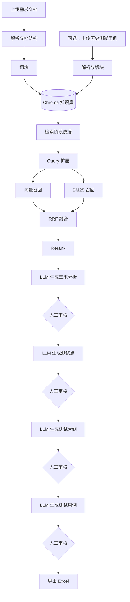

# AI Test Case Generator

一个面向测试设计场景的 AI 测试用例生成工具。

它把需求文档解析、RAG 检索、需求分析、测试点提取、测试大纲生成、测试用例生成、人工审核和 Excel 导出串成一条完整工作流。项目当前使用 `Streamlit + LangGraph + LangChain + Chroma + OpenAI-Compatible LLM`，检索侧已经支持混合检索：向量召回 + BM25 召回 + RRF 融合 + rerank。

---

## 1. 核心能力

- 上传需求文档，支持 `.md` 和 `.docx`
- 自动解析文档结构，保留章节和表格内容
- 将文档切块后写入 Chroma 本地向量库
- 使用混合检索召回需求依据和历史用例依据
- 使用 LLM 生成需求分析、测试点、测试大纲和测试用例
- 支持每个关键阶段人工审核和修改
- 支持上传历史测试用例知识库，用作新用例生成参考
- 导出结构化测试用例到 Excel
- 在页面中展示检索证据、引用、rerank 状态和降级原因

---

## 2. 快速开始

### 2.1 安装依赖

如果项目里已经有 `requirements.txt`：

```bash
pip install -r requirements.txt
```

如果没有，可以先安装核心依赖：

```bash
pip install streamlit python-dotenv langchain langchain-openai langgraph chromadb openpyxl mistune python-docx sentence-transformers
```

### 2.2 配置环境变量

复制环境变量模板：

```bash
copy .env.example .env
```

然后在 `.env` 中配置：

```env
OPENAI_API_KEY=your_openai_api_key_here
OPENAI_BASE_URL=your_openai_base_url_here
```

说明：

- `OPENAI_API_KEY` 用于聊天模型和 embedding 模型
- `OPENAI_BASE_URL` 支持 OpenAI 官方接口，也支持 OpenAI-Compatible 代理服务
- 如果远程 embedding 不可用，项目会自动退回本地 `LocalHashEmbeddings`

### 2.3 启动应用

在项目根目录运行：

```bash
streamlit run app/app.py
```

启动后，在浏览器里打开 Streamlit 页面即可使用。

---

## 3. 使用流程

1. 上传需求文档
2. 系统解析 `.md` 或 `.docx`
3. 系统切块并写入 Chroma
4. 系统检索需求相关片段
5. LLM 生成需求分析
6. 用户审核或修改需求分析
7. 系统检索测试点相关片段
8. LLM 生成测试点
9. 用户审核或修改测试点
10. 系统检索测试大纲相关片段
11. LLM 生成测试大纲
12. 用户审核或修改测试大纲
13. 系统同时检索需求依据和历史测试用例依据
14. LLM 生成测试用例
15. 用户审核或修改测试用例
16. 导出 Excel

---

## 4. 工作流架构



这张图只画主路径。实际代码里，每个生成阶段都会先调用检索层，拿到上下文片段后再调用对应的 prompt 和 LLM。

---

## 5. 项目结构

```text
ai-test-case-generator/
├─ app/
│  └─ app.py                         # Streamlit 页面入口
├─ data/
│  └─ chroma/                        # Chroma 持久化目录
├─ output/                           # 导出的 Excel 文件
├─ rag/
│  ├─ config.py                      # RAG 配置
│  ├─ ingest.py                      # 文档切块与入库
│  ├─ query_expander.py              # Query 扩展
│  ├─ reranker.py                    # Rerank 重排
│  ├─ retriever.py                   # 检索主逻辑
│  ├─ schemas.py                     # Chunk / Citation 数据结构
│  ├─ store.py                       # Chroma 和 Embedding 初始化
│  ├─ index_testcase_kb.py           # 历史用例知识库入库脚本
│  └─ eval_offline.py                # 离线检索验证脚本
├─ skills/
│  ├─ analyze_requirement_skill.md
│  ├─ extract_test_points_skill.md
│  ├─ generate_outline_skill.md
│  ├─ generate_cases_skill.md
│  └─ test_design_skills.py
├─ utils/
│  ├─ document_parser/               # Markdown / DOCX 解析
│  └─ excel_exporter/                # Excel 导出
├─ workflow/
│  ├─ workflow.py                    # LangGraph 工作流定义
│  ├─ nodes.py                       # 工作流节点实现
│  ├─ state.py                       # 工作流状态
│  └─ schemas.py                     # 测试点 / 大纲 / 用例结构
├─ .env.example
├─ README.md
└─ README2.md
```

---

## 6. RAG 和混合检索

当前检索链路是：

```text
原始 query
  -> multi-query 扩展
  -> 每条 query 分别检索
  -> 向量召回
  -> BM25 召回
  -> RRF 融合
  -> 按 chunk_id 去重
  -> rerank
  -> 返回最终上下文
```

### 6.1 向量召回

向量召回使用 Chroma。

当 `SEARCH_TYPE = "mmr"` 时，会调用最大边际相关性检索，优先兼顾相关性和多样性。MMR 返回结果没有稳定的原始分数，所以代码里会先记为 `0.0`。

### 6.2 BM25 召回

BM25 召回没有维护独立索引文件，而是复用 Chroma 中已入库的 `documents` 和 `metadatas`。

检索时，系统会按当前 `doc_type`、`doc_id` 和额外 metadata 过滤出候选文档，然后现场计算 BM25 分数。这个实现的好处是改动小，不需要额外重建 BM25 索引；代价是数据量很大时，BM25 路径会增加一些查询耗时。

### 6.3 RRF 融合

向量分数和 BM25 分数不是同一量纲，所以项目使用 RRF（Reciprocal Rank Fusion）按排名融合两路结果。

融合后返回的 `score` 更接近“融合排序分”，不一定等于某一路检索的原始相关性分数。

### 6.4 Rerank

初检索和融合后，系统会把候选片段送入 rerank。

默认配置优先使用：

```python
RERANK_MODE = "cross_encoder"
RERANK_CROSS_ENCODER_MODEL = "BAAI/bge-reranker-v2-m3"
```

如果本地模型不可用、加载失败或推理超时，会回退到 `lite` rerank。

---

## 7. 关键配置

主要配置在 `rag/config.py`。

### 7.1 向量库和切块

```python
PERSIST_DIRECTORY = "data/chroma"
COLLECTION_NAME = "test_case_rag_v1"
EMBEDDING_MODEL = "text-embedding-3-small"
CHUNK_SIZE = 500
CHUNK_OVERLAP = 80
```

### 7.2 检索

```python
RETRIEVER_TOP_K = 8
FETCH_K = 20
SEARCH_TYPE = "mmr"
HYBRID_SEARCH_ENABLED = True
BM25_TOP_K = 8
RRF_K = 60
```

说明：

- `HYBRID_SEARCH_ENABLED = True` 表示启用向量 + BM25 混合检索
- 改成 `False` 后，会退回纯向量检索
- `BM25_TOP_K` 控制 BM25 路径保留多少候选
- `RRF_K` 控制 RRF 融合时排名贡献的平滑程度

### 7.3 Query 扩展

```python
MULTI_QUERY_ENABLED = True
QUERY_COUNT = 3
PER_QUERY_TOP_K = 3
```

开启后，一个阶段 query 会被扩展成多个 query，再分别检索，提升召回覆盖率。

### 7.4 Rerank

```python
ENABLE_RERANK = True
RERANK_MODE = "cross_encoder"
RERANK_CROSS_ENCODER_MODEL = "BAAI/bge-reranker-v2-m3"
RERANK_CROSS_ENCODER_LOCAL_FILES_ONLY = True
RERANK_TIMEOUT_MS = 30000
RERANK_CANDIDATE_POOL = 12
RERANK_FINAL_TOP_N = 5
```

---

## 8. 主要模块说明

### 8.1 `app/app.py`

负责 Streamlit 页面，包括文件上传、阶段展示、人工审核、重新生成、历史用例知识库上传、检索证据展示和 Excel 下载。

### 8.2 `workflow/workflow.py`

定义 LangGraph 工作流。当前主要节点是：

- `analyze_requirement_node`
- `extract_test_points_node`
- `generate_outline_node`
- `generate_cases_node`
- `export_excel_node`

### 8.3 `workflow/nodes.py`

每个节点负责一个阶段的实际执行。典型流程是：

```text
构造 query -> 检索上下文 -> 调用 skill -> 返回结构化结果
```

`generate_cases_node` 比较特殊，它会同时检索需求依据和历史测试用例依据，再合并上下文生成最终用例。

### 8.4 `rag/ingest.py`

负责把解析后的结构化文档转换为 chunk，并写入 Chroma。

每个 chunk 会携带：

- `chunk_id`
- `doc_id`
- `doc_type`
- `source_name`
- `section_path`
- `paragraph_index`
- `module`
- `test_type`
- `priority`

### 8.5 `rag/retriever.py`

负责统一检索入口。

它会处理：

- requirement / testcase 两类文档过滤
- multi-query 扩展
- 向量召回
- BM25 召回
- RRF 融合
- 去重
- rerank
- citation 构造

### 8.6 `rag/reranker.py`

负责重排候选片段。

当前支持：

- `cross_encoder`
- `lite`
- cross-encoder 失败后自动 fallback

### 8.7 `skills/test_design_skills.py`

负责 prompt 加载、LLM 调用、结构化输出和 JSON fallback。

它让上层节点可以用比较稳定的方式拿到：

- 需求分析文本
- 测试点列表
- 测试大纲列表
- 测试用例列表

---

## 9. 常用脚本

### 9.1 文档解析演示

```bash
python utils/document_parser/run_parser_demo.py
```

### 9.2 工作流验证

```bash
python workflow/main_test.py
```

### 9.3 历史用例知识库入库

```bash
python rag/index_testcase_kb.py --dir your_testcase_dir
```

### 9.4 离线检索验证

```bash
python rag/eval_offline.py --input your_file.md --query "你的问题"
```

---

## 10. 常见问题

### Q1：为什么检索结果里的 score 看起来很小，或者经常是 0？

当 `SEARCH_TYPE = "mmr"` 时，向量召回阶段没有真实原始分数，代码会先记为 `0.0`。开启混合检索后，最终 score 可能是 RRF 融合分，也不是单一路径的原始相似度。

所以 score 更适合用来观察排序，不适合直接解释为“相似度百分比”。

### Q2：为什么某个阶段没有检索到依据？

常见原因：

- 文档没有成功入库
- 当前 `doc_id` 不匹配
- query 太抽象
- 文档里缺少对应关键词
- 历史测试用例知识库为空

建议先看页面里的检索证据区域，重点关注 `expanded_queries`、`pre_dedup_count`、`post_dedup_count` 和命中的 chunk。

### Q3：为什么 rerank 会降级？

默认 rerank 使用本地 cross-encoder。如果模型没有本地缓存、无法加载、推理报错或超时，就会自动退回 `lite`。

只要主流程能继续执行，这属于预期行为。

### Q4：混合检索需要重新入库吗？

这版实现不需要额外维护 BM25 索引文件。BM25 直接复用 Chroma 中已有的文本和 metadata。

如果你的文档已经入过 Chroma，通常不需要因为混合检索重新入库。只有当 Chroma 数据本身缺失或过旧时，才需要重新上传或重新入库。

### Q5：历史测试用例知识库有什么用？

需求文档告诉系统“测什么”，历史测试用例知识库更偏向告诉系统“怎么写”。

生成测试用例时，系统会同时检索需求依据和历史用例依据，再把两路上下文合并给 LLM。

---

## 11. 二次开发入口

如果你想继续扩展项目，可以从这些地方入手：

- 改页面：`app/app.py`
- 改工作流：`workflow/workflow.py`
- 改节点逻辑：`workflow/nodes.py`
- 改检索：`rag/retriever.py`
- 改 rerank：`rag/reranker.py`
- 改切块：`rag/ingest.py`
- 改 prompt：`skills/*.md`
- 改结构化输出：`skills/test_design_skills.py`
- 改 Excel 模板：`utils/excel_exporter/excel_exporter.py`

---

## 12. 当前设计取舍

这个项目当前的设计更偏向“可运行、可解释、便于调试”：

- 使用 LangGraph 把多阶段生成流程拆清楚
- 每个阶段都保留人工审核点
- 检索证据会展示在页面上，方便解释结果来源
- 混合检索复用 Chroma 数据，减少额外索引维护成本
- rerank 有 fallback，避免模型不可用时主流程直接中断
- JSON 输出有 fallback 和 repair，降低结构化生成失败率

它不是一次性黑盒生成器，而是一个带检索依据、人工审核和可调试链路的 AI 测试设计工作台。
